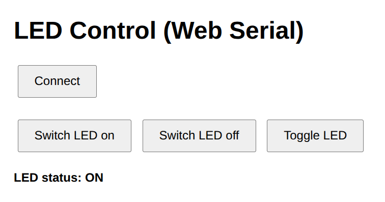

# Web Serial Blinky

This is a project for learning how to control an embedded device using a web interface.

Unfortunately, the Web Serial API currently works only in Google Chrome.

## Interface

